## 知识蒸馏

>把复杂模型或者多个模型Ensemble（Teacher）学到的知识 迁移到另一个轻量级模型（ Student ）上叫知识蒸馏。使模型变轻量的同时（方便部署），尽量不损失性能。

知识蒸馏(Knowledge Distillation)KD属于模型压缩、加速的一类玩法。在这里，知识应该宽泛和抽象地理解，模型参数，网络层的输出（网络提取的特征）、网络输出等都可以理解为知识。

## KD 种类
KD主要分为三个大类：
* **Output Transfer** - 将网络的输出（Soft-target，后面会介绍其含义）作为知识；
* **Feature Transfer** - 将网络学习的特征作为知识;
* **Relation Transfer** - 将网络或者样本的关系作为知识

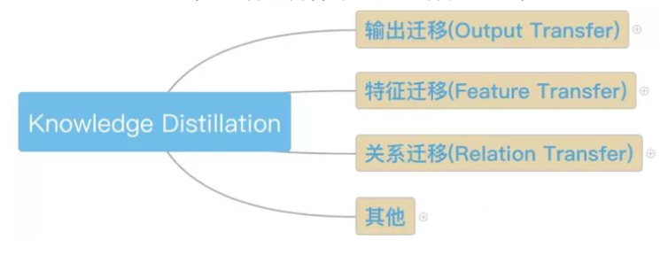

从时间线上来看，KD的发展脉络大致如下(部分论文)：
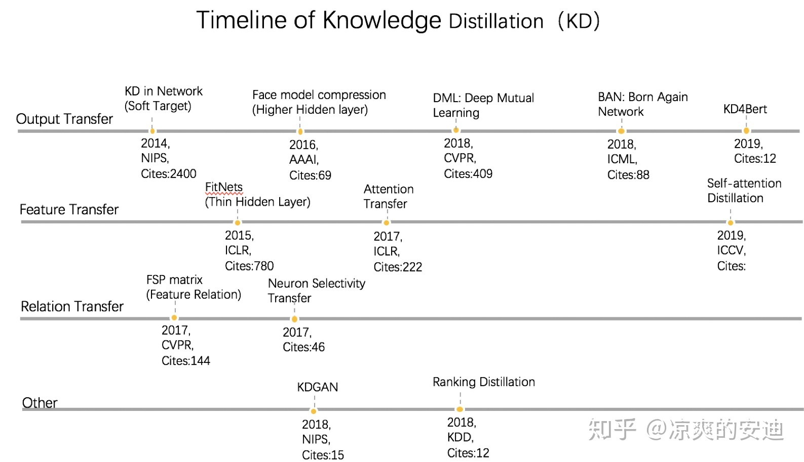

### 1. Outpt Transfer

Output transfer ————将网路的输出(Soft-target),作为知识。

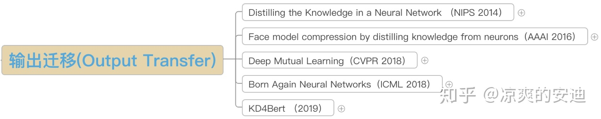

#### 1.1 《Distilling the Knowledge in a Neural Network 》

Hinton在NIPS 2014 workshop 上提出
术语定义：
* Teacher:原始较大的模型或模型Ensemble,用于获取知识
* Student：新的较小的模型，接收teacher的知识，训练后用于前向预测
* Hard target: 样本原本的标签，One-hot
* Soft target: Teacher输出的预测结果(一般是softmax之后的概率)

下面是 **蒸馏的过程**：

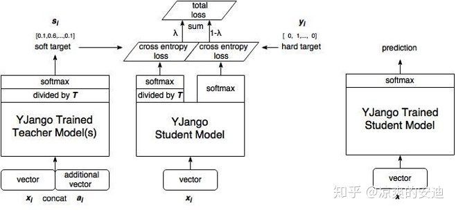

1. 在原始数据集上，使用hard target,训练好一个 teacher 网络;
2. 将 teacher 的网络输出结果 soft target ———— **q** 作为 student 网络的目标，训练 student网络，使得student网络的结果p接近q;
3. LOSS为：
   * teacher网络的loss：$L=CrossEntropy(x,y)$
   * student网络的loss: $L=\alpha CrossEntropy(x,y) + (1-\alpha )CrossEntropy(x,q)$
   * 其中y是真实标签的one-hot编码，q是teacher网络的输出结果，p是student网络的输出结果
4. 最终使用student网络来进行预测

**从模型效果上看**：
数据集：MNIST
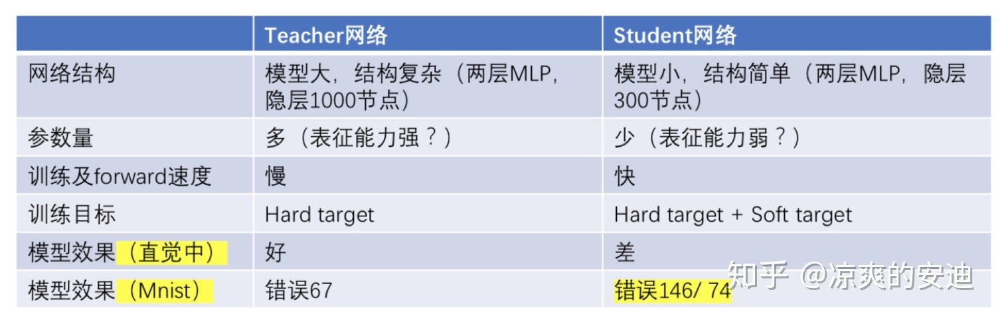

Teacher网络模型复杂，参数多，表征能力强，使用 Hard Target作为训练目标，从直觉上看，效果应该是好的(参数多)，最终在测试集上错了67个

Student网络模型简单，参数少，表征能力弱，在直接用 Hard target 作为训练目标时(不使用 Knowledge Distillation),在测试集上错了146；使用Hard target + Soft target作为训练目标时，错了74个。

可以看出，加入 Soft target后，小网络从大网络中继承了大网络中学习的知识，但是这个实验中，最好的结果没有超过 baseline.

考虑起主要效果的因子：

以Mnist数据集为例，对于数字9而言，数字9和数字4和7长得比较像，网络在进行训练时，我们如果能够将 **数字之间的相似关系传递给模型** ，则网络可能学习到更好的结果。
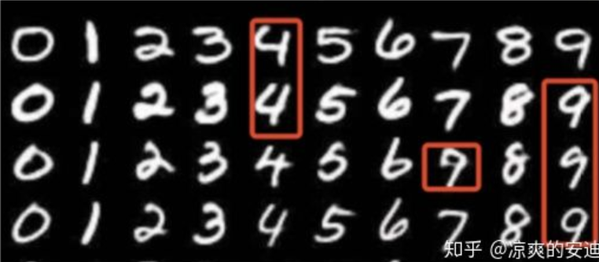

而对于Hard target 和 Soft target
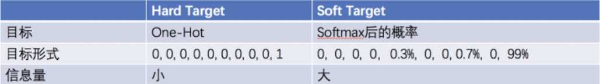

我们可以看到，软目标的优势在于：
* 弥补了简单分类中监督信号不足(信息熵比较少)的问题，增加了信息量。
* 提供了训练数据中类别之间的关系(数据增强)
* 可能增强了模型泛化能力

关于软目标相关的思考，还有 Label smoothing Regularization(LSR),即“**标签平滑归一化**”。LSR也是对“硬目标”的优化：
* 对于Target————One-hot的改进
* One-hot带来的问题：
  * 0-1标签over-confident,容易“过拟合”，泛化能力差
  * 对于“模棱两可”的样本表征较差
* 解决方案
  * 让标签less-confident,增强泛化能力 $y^{LS}_k = y_K(1-\alpha)+\alpha / K$
  * 其中 $y^{LS}_K$是平滑后的标签；$y_k$是One-hot标签；k为类别数；$\alpha$是一个超参

在经典的蒸馏网络中，参数T是一个超参数————温度，T表示软目标要 soft的程度：
$$
teacher的q"软化"为：q_i = \frac{exp(z_i/T)}{\sum_jexp(z_j/ T)}
$$
* T =1,公式同 softmax输出后的结果
* T越接近0，公式越同 One-hot编码，最大值趋向于1，最小值趋向于0；
* 提升T，则保留更多类别关系信息；

#### 1.2 《Distilling Task-Specific Knowledge from BERT into Simple Neural Networks》
本文是对BERT网络进行蒸馏，其思想和经典蒸馏网络并无区别

**背景:**
* 18年底，Bert在很多NLp任务上取得了 SOTA，但线上运行时，算力是“瓶颈”。
* KD在NLP应用较少
* 本文希望用Bi-LSTM网络蒸馏Bert网络

**网络Loss:**
同经典KD，LOSS分为两个部分：
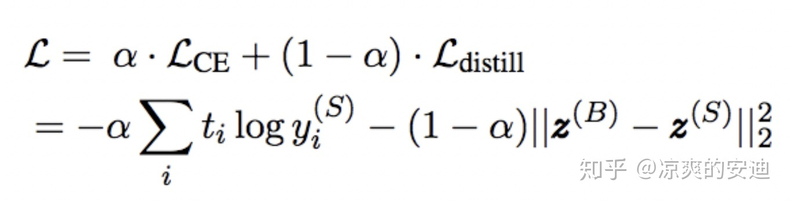

**网络结构：**
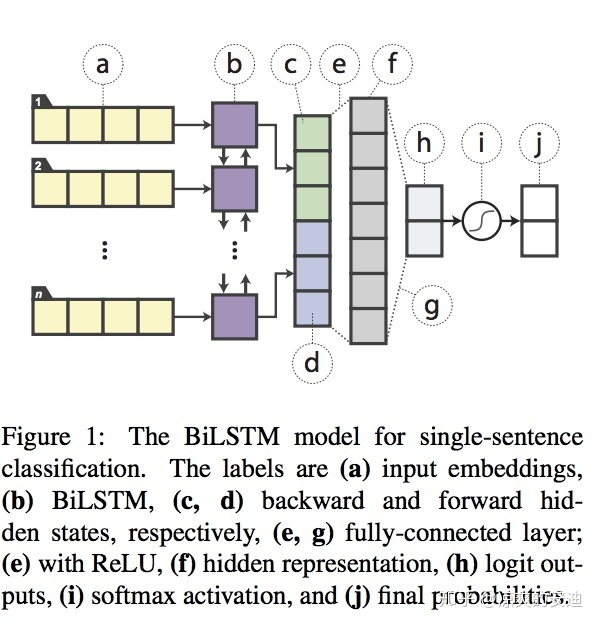

**效果：**
可以看出蒸馏的结果弱于Bert但是比原始的双向LSTM效果好很多
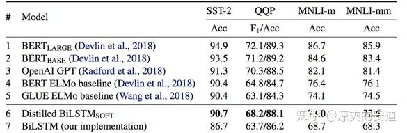

#### 1.3 《Deep Mutual Learning》
**背景：**
* 在经典的蒸馏过程中，teacher网络固定，只用来输出 soft-target，难以学习 student反馈的信息，进而对训练过程进行优化
* 本文提出 **深度互学习**，多个学生网络同时训练，通过真值和多个网络的输出结果“相互借鉴，共同进步”
* 本文不以模型压缩为主要目的，更多为了提升模型表现。

**网络结构：**
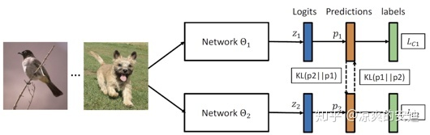

**网络LOSS:**
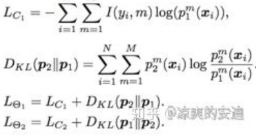

思路比较简单，$L_{c1}$是经典交叉熵，$D_{KL}$是KL散度。

**实施：**
* 输入：训练集X，标签集Y
* 初始化：两个网络的不同的$\theta_1,\theta_2$
* 步骤：
  * 前向：选择一个batch数据，分别对两个网络进行预测，并计算$\theta_1,\theta_2$
  * 后向：基于LOSS,分别对$\theta_1,\theta_2$进行优化

当存在多个子网络时：
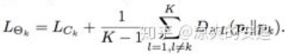

**效果：**
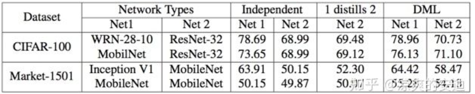

可以看出，在DML思路下，网络效果比单个网络有了明显的提升；效果比经典的蒸馏网络也提升较大。

**有效因子：**
* 类别概率中包含了更多信息(同经典KD)
* 深度互学习的方法可能找到了更平缓的极值点(意味着泛化能力更强，小的波动不会对预测产生较大的影响)，如下图所示，DML网络的Loss和单独训练网络的Loss接近，但是，当对参数添加噪声时，DML的Loss小于单独训练的Loss（当网络输出对于输入噪声的敏感程度比较差的时候，可以认为网络输出处于一个比较平缓的局部最优点）

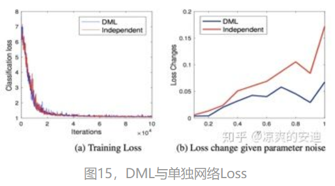

#### 1.4 《Born Again Neural Networks》再生网络
**思路：**
* 再生网络也不再以模型压缩为主要目的，更多为了提升模型表现
* 再生网络基于蒸馏学习的理念，提供了一种 Esemble的思路
* 教师、学生网络结构相同，第n个学生目标训练第n+1个学生，“口口相传”
* 最后进行集成

**网络结构：**
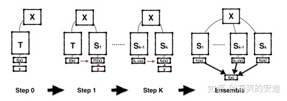

### 2. Feature Transfer
Feature Transfer————将网络学习的特征作为知识。在深度学习种，一般将隐藏层的输出看作是网络学习的特征，下面两篇paper中：第一篇以 **MLP** 为基础框架，则网络提取的特征为每个 **隐藏层的输出向量**；第二篇paper以CNN为基础框架，则网络提出的 **特征为每层的Feature Map**.
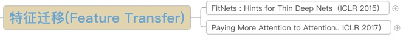

#### 2.1 《FitNets: Hints for Thin Deep Nets》
**背景：**
* Deep可能是DNN主要拟合能力的重要来源，之前的KD工作都是用较浅的网络作为student net,拟合能力可能较弱
* 这篇文章把"宽"且“深”的网络蒸馏成“瘦”且“更深”的网络

**思路：**
* 学生网络不仅仅拟合教师网络的 soft-tarret,而且**拟合隐藏层的输出(教师抽取的特征)**；
* 第一阶段让学生网络区学习 **教师网络的隐藏层输出(特征迁移)**；
* 第二阶段使用 **soft targets**来训练学生网络(输出迁移)

**网络结构：**
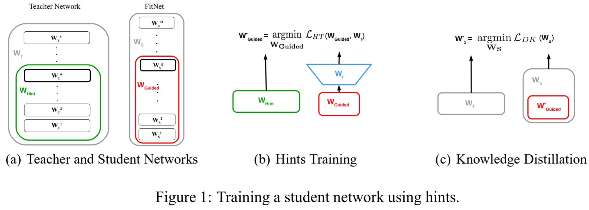

**实施：**
* $W_T$是教师网络的所有参数，$W_S$是学生网络的所有参数；
* $W_{Hint}$ 是教师的部分层的参数(绿框)； $W_{Guided}$是学生网络的部分层的参数(红框)；
* $W_r$是一个全连接层，用于将两个网络输出的size配齐(因为学生网络隐藏层宽度比教师网络窄)
* 两阶段训练：
  * 第一阶段：让 $W_{Guided}$最高层的输出拟合 $W_{Hint}$最高层输出用第一个Loss(特征迁移)，参数初始化
  * 用 Soft-target 方式对学校网络整体进行蒸馏(输出迁移)
* 两个阶段的LOSS:
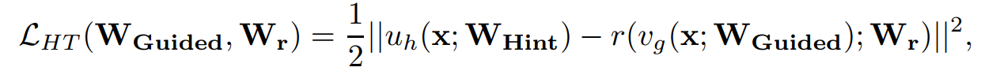
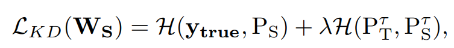

#### 2.2 《Paying More Attention to Attention: Improving the Performance of Convolutional Neural Networks via Attention Transfer》

**思路：**
* 思路一：对卷积网络隐藏层输出的特征图————feature map(特征&知识)进行迁移(Attention transfer)，让学生网络的feature map与教师网络的 feature map尽可能相似
* Loss对输入X求导，得到梯度更大的像素点，表明“更重要”，需要pay more attention
* 该特征迁移的方法也可以与 soft-target的方式结合

**网络结构：**
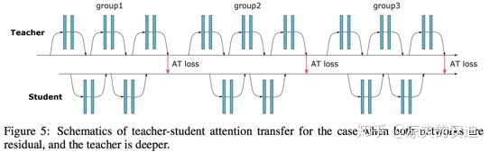

**思路1----Activation-based attention transfer:**
* 对卷积网络隐藏层输出的特征图--feature map(特征&知识)进行迁移(Attention transfer),让学生网络的feature map与教师网络的feature map尽可能相似；
* 该特征迁移的方法也可以与 soft-target的方式结合

**实施：**
* 首先将Teacher网络和Student网络都分成n个part(两者分part的数量相同)，每个part内包含几个卷积核池化层都是可以的，不过为了提升预估的效率，一般学生网络每个part的网络结构比教师网络简单，同时，保证学生网络和教师网络每个part的最后一个卷积层得到的 feature map的size的大小相同，都是 W*H（数量可以不同）
* 接下来，为了计算loss,每个part的最后一个卷积层C个 *W\*H* 的特征图变换为1个 *W\*H*的二维张量，原文提供了以下三种方式(比较简单可以回原paper详读)：
  * 特征图张量各通道绝对值相加；
  * 特征图张量各通道绝对值P次幂相加；
  * 取特征图张量各通道绝对值p次幂最大值
* 然后，计算教师网络和学生网络的特征图差异，并使其变小。

**网络Loss:**
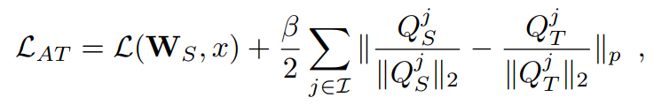

* Loss分为两个部分，第一部分为交叉熵，第二部分Loss衡量学生和教师特征图之间的差异
* $W_T$是教师网络的所有参数，$W_S$是学生网络的所有参数；p表示 $L_P Normalization$
* $Q_T = vec(教师网络的特征图)$， $Q_S = vec(学生网络的特征图)$
* vec是一个映射函数，用于将特征图映射成向量(文中没有找到具体含义，可能类似 flatten 操作)
* 也可以在这个 Loss的基础上结合经典KD的软目标LOSS

**思路2----Gradient -based attenton transfer:**
Loss对输入X求导，判断损失函数对于输入X的敏感性，pay more attention to 值得注意的像素(梯度大的像素)

**网络LOSS:**
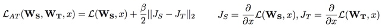

* Loss分为两个部分，第一部分为交叉熵，第二部分衡量教师网络和学生网络像素点的差异
* $W_T$是教师网络的所有参数，$W_S$是学生网络的所有参数
* 也可以在这个LOSS的基础上结合经典KD的软目标LOSS

* 注：
  * 每次跟新都要计算两次
  * 第一次计算出 $J_S,J_T$，即LOSS的第二部分
  * 第二次对学生网络的参数进行更新

### 3 Relation Transfer
Relation Transfer----将网络或者样本的关系作为知识，该部分将主要介绍下一篇papaer:

#### 3.1 《A Gift from Knowledge Distillation: Fast Optimization, Network Minimization and Transfer Learning》

**思路：**
学生网络学习教师网络层与层之间的关系(特征关系)

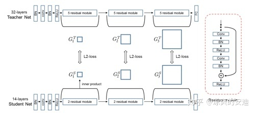

**实施：**
* 首先将Teacher网络和Student网络都分成n个part（两者分part的数量相同），每个part内包含几个卷积核池化层都是可以的，不过为了提升预估的效率，一般学生网络每个part的网络结构比教师网络简单。同时，保证学生网络和教师网络每个part的最后一个卷积层feature map的数量与下一个part第一个卷积层feature map的数量的数量相等；
* 定义”FSP matrix“用于衡量两层特征之间的关系，用前一层的特征图与下一层的特征图element-wise相乘并求和：
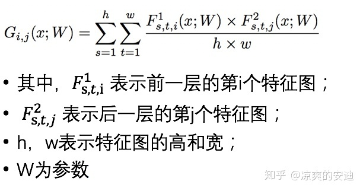

* 该步骤计算完毕后，可以得到一个 **m*n**的 FSP matrix
* 训练分为两个阶段：
  * 第一个阶段，用FSP预训练学生网络的参数
  * 第二个阶段，用正常拿的分类loss优化学生网络

**效果：**
在多个数据集上学生网络在参数减少很多的情况下，效果接近教师网络，且优于FitNets

### 4. others

#### 4.1 《KDGAN: Knowledge Distillation with Generative Adversarial Networks》

**背景：**
* 原始蒸馏网络中，学生网络难以学习到教师网络的所所有知识，效果可能略差于教师网络
* 用 **对抗生成的方式**模拟蒸馏的过程：生成器(学生网络，参数少、简单)负责基于输入X输出X的标签Y,判别器(教师网络，参数多、复杂)判断表亲啊来自学生网络还是真实的数据
* 前向计算时，只是用生成器，实现蒸馏的目的。

**GAN回顾：**
* GAN常用于图像生成；
* 经典GAN中，生成器G基于随机噪声输出图像；判别器D是一个分类器，判别图像是真实图像还是生成的。
* 最大-最小迭代训练：
  * 固定G，用G的生成结果和真实数据优化D,使得$V(D,G)$尽可能大；
  * 固定D，基于D的结果优化G，使得$V(D,G)$尽可能小
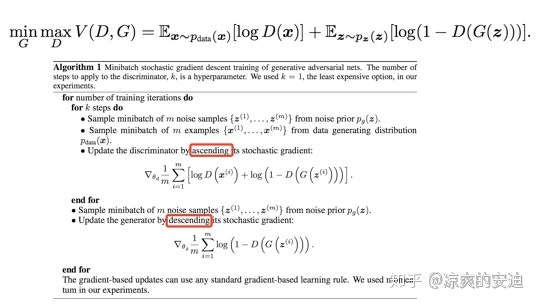

KDGAN里作者提出了两种网络：NaGAN,KDGAN

**思路1：NaGAN**
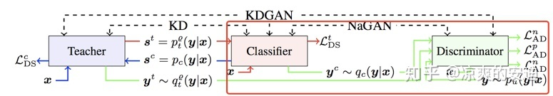

**实施：**
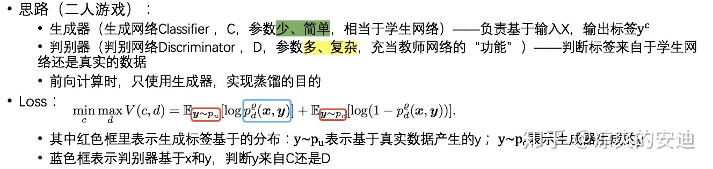

**优劣：**
* KD需要样本少，但是通常不能保证学术网络的效果达到教师网络的程度
* NaGAN需要样本大于KD,但是通常可以使得学生网络效果和教师网络差不多

**思路2：KDGAN**
**网路结构:**
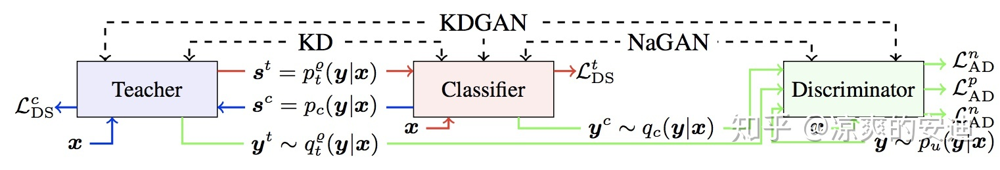
**实施：**
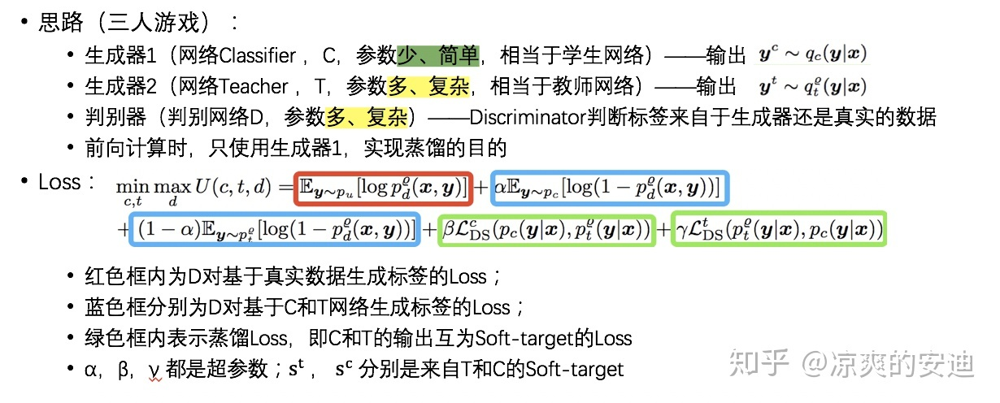

**训练过程：**
* 训练D:固定T和S,最大化似然函数。D更新时，希望将真实样本标签判别为1；将C和T生成的标签判别为0，因此最大化D更新的损失函数。
* 训练T:固定D和S,最小化损失函数。损失函数分为两部分，第一部分为判别器D对于T生成的标签真实性的判别，T希望D判别的概率越小越好；第二部分为蒸馏LOSS，T网络取拟合S网路输出的软目标；
* 训练S:固定D和T，最小化损失函数。第一部分为判别器D对于S生成的标签真实性的判别，S希望D判别的概率越小越好；第二部分为蒸馏Loss，S网络去拟合T网络输出的软目标。

#### 4.2 《Ranking Distillation: Learning Compact Ranking Models With High Performance for Recommender System》

**背景：**
* 检索学习或者推荐系统中模型庞大，可以用蒸馏网路的方式提升工程效率；
* 目标是给一个 query，预测检索系统的TOP K相关的 doc

**思路：**
* 第一阶段训练教师网络，对于每个query预测TOP K相关doc，补充为学生网络的 Ground truth信息。
* 第二阶段教师网络的Top K作为正例加到学生网络中一起进行训练，使得学生网络和教师网络的预测结果更像。

**LOSS:**
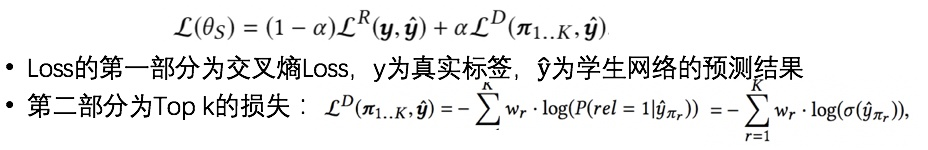

**网络结构：**
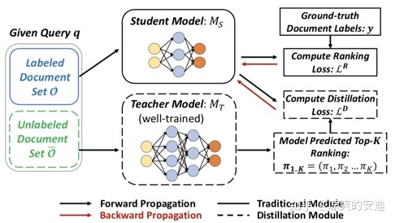

## 讨论
把复杂模型或者多个模型Ensemble(Teacher)学到的知识---》迁移到另一个轻量级模型(Student)叫知识蒸馏。知识蒸馏属于模型压缩、加速的一类，要求在模型变轻量的同时(方便部署)，尽量不损失性能，后来也应用于模型表现的提升。

按照迁移知识的类型大致可分为三大类：
* Output Transfer----将网络的输出----soft-target作为知识；
* Feature Transfer----将网络学习的特征作为知识
* Relation Transfer----将网络或者样本的关系作为知识

知识蒸馏提升了模型的工程表现，相对于其他模型压缩方式，如模型Int8而言，KD给了我们更多的想象空间，毕竟如DML等训练方式，可能在一定程度上提升模型的效果。

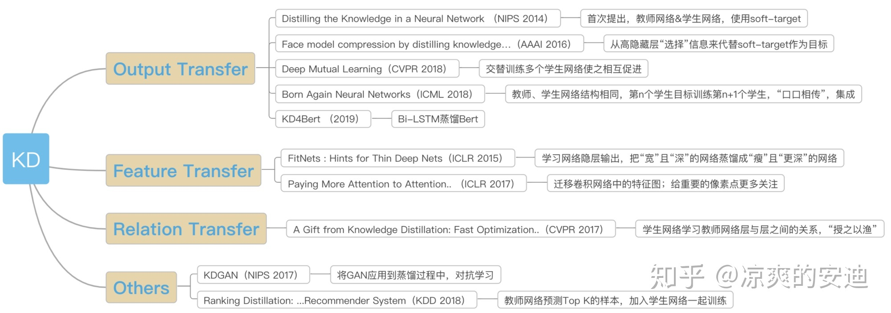

