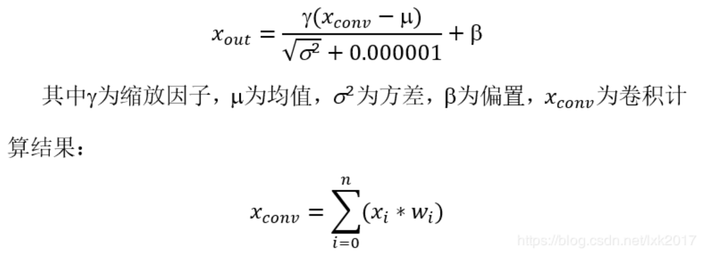
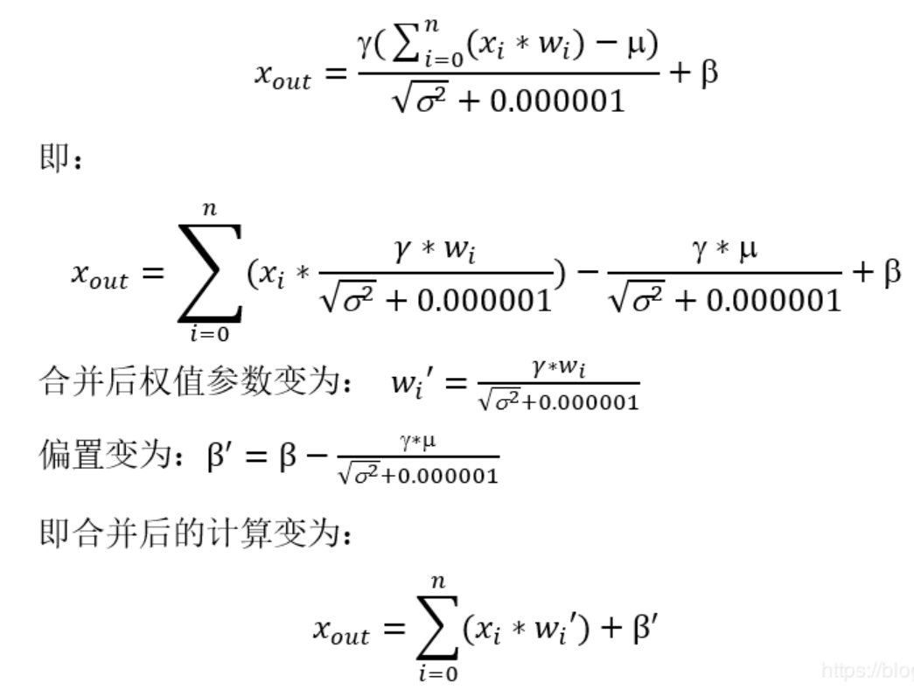
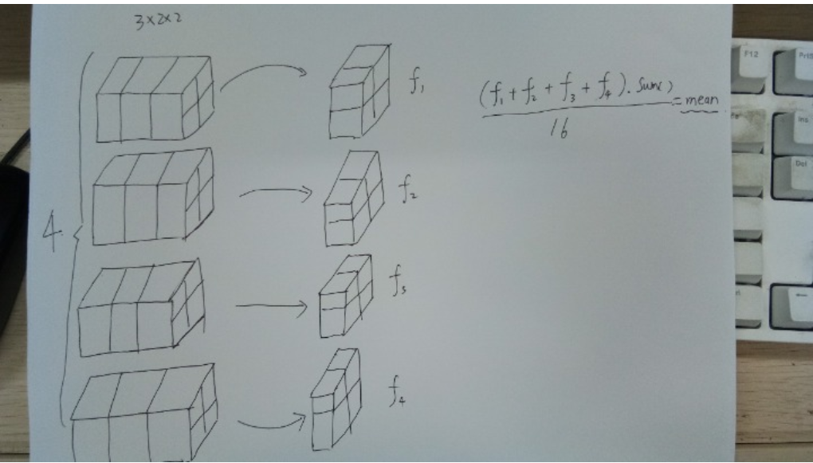
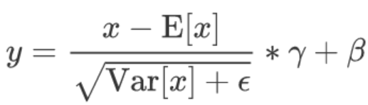
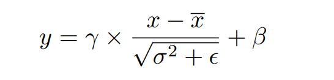
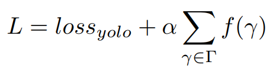

# BN
BN层能加速网络收敛，并且能够控制过拟合现象的发生，一般放在 **卷积层**之后，**激活层**之前。BN层将数据归一化之后，能够有效解决梯度消失与梯度爆炸问题，虽然BN层在训练时起到了积极作用，然而，在网络 inference 时多了一些层的运算，影响了模型的性能，且占用更多的内存或者显存空间，因此，有必要 **将BN层的参数合并到卷积层**，减少计算来提升模型 Inference 的速度。


# 合并卷积层和BN层



# BN细节
假设经过卷积操作输出的 feature map 的尺寸为 
4 x 3 x 2 x 2 
N   C   H   W 



对于一个 batch中的 **同一个Channel** 的元素进行均值和方差，对比上图，对于所有的batch，都拿出来最后一个 channel ，一共有 4 x 4 = 16

然后求着16个元素的方差和均值

求出方差和均值之后，对于这16个元素中的每个元数进行减去求取得到均值和方差，乘以gamma加上beta，公式如下：


所以对于一个batch normalization层而言，求取的均值与方差是对于 **所有batch中的同一个channel** 进行求取，batch normalization中的batch体现在这个地方

batch normalization层能够学习到的参数，对于一个特定的channel而言实际上是两个参数，**gamma与beta** ，对于total的channel而言实际上是 **channel数目的两倍**

# 验证
```python 

import torch
import torch.nn as nn
m = nn.BatchNorm2d(3)
input = torch.randn(4,3,2,2)
BatchNorm2d(3, eps=1e-05, momentum=0.1, affine=True, track_running_stats=True)
out = m(input)
out
'''
tensor([[[[-0.2873, -0.5528],
          [ 0.3805, -0.2553]],
         [[-2.0113,  1.5142],
          [-0.0720,  0.3511]],
         [[-1.7395, -1.4133],
          [ 1.0271,  0.0621]]],
        [[[ 0.1454,  0.9338],
          [ 0.7313,  0.1748]],
         [[ 1.3994,  0.3387],
          [ 0.8337, -0.1193]],
         [[-0.2720,  0.1136],
          [ 1.4480, -0.3744]]],
        [[[ 0.8298, -0.2768],
          [-0.6330, -0.0817]],
         [[ 0.1824, -0.8287],
          [ 1.7352, -0.5956]],
         [[-0.4318, -0.6588],
          [-0.3629,  0.8955]]],
        [[[-1.7147, -1.5949],
          [ 2.6601, -0.4592]],
         [[ 0.0520, -1.1259],
          [-0.7108, -0.9431]],
         [[ 0.7661,  2.0770],
          [-1.0648, -0.0717]]]], grad_fn=<NativeBatchNormBackward>)
'''
m.running_mean
# tensor([ 0.0059,  0.0142, -0.0405])
m.momentum=1
# tensor([ 0.0593,  0.1424, -0.4049])
a = (input[0, 0, :, :]+input[1, 0, :, :]+input[2, 0, :, :]+input[3, 0, :, :]).sum()/16
a
# tensor(0.0593)

```

# 在BN层上添加L1正则化


where $\gamma$ and $\beta$ denotes **trainable scale factor** and **bias**.
Naturally, we directly adopt the trainable scale factors in BN layers as indicators of channel importance. To discriminate important channels from unimportant channels effectively, we perform channel-wise sparsity training by imposing L1 regularization on $\gamma$. The training objetive of sparsity training is given by:



where $f(\gamma) = |\gamma|$ denotes L1-norm and $\alpha$ denotes penalty factor that balances two loss terms. In our implementation, we use subgradient method to optimize the non-smooth L1 penalty term as Liu er al did.

# 次梯度下降法
Subgradient 次梯度，子梯度，因为有一些凸函数是不可导的，不能直接使用 梯度。子梯度也是求解凸函数的，只是凸函数不是处处可导。

# 算法实现
```python
# additional subgradient descent on the sparsity-induced penalty term
# x_{k+1} = x_{k} - \alpha_{k} * g^{k}
def updateBN(scale, model):
    for m in model.modules():
        if isinstance(m, nn.BatchNorm2d):
            m.weight.grad.data.add_(scale*torch.sign(m.weight.data))  # L1

...............


            if ni % accumulate == 0:
                if opt.sparsity != 0:
                    updateBN(opt.sparsity, model)
```