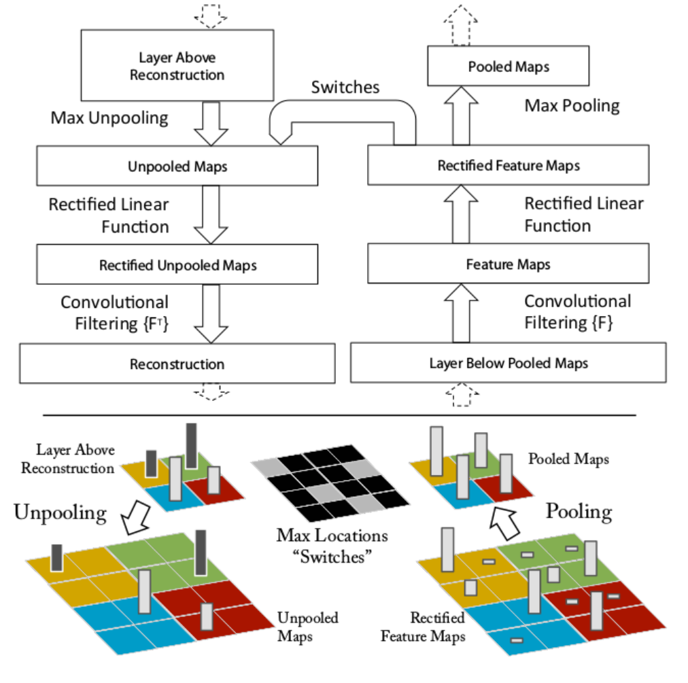
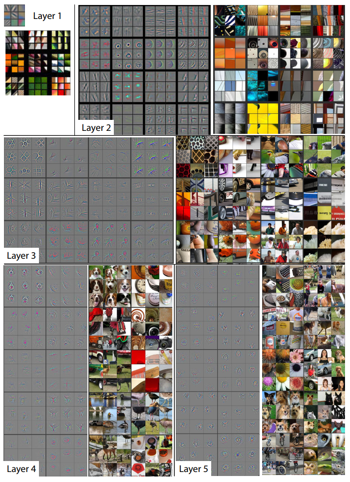
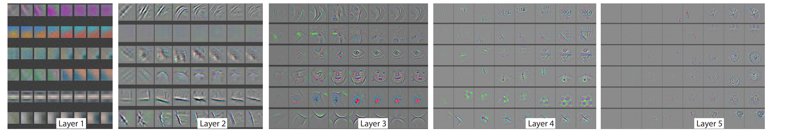
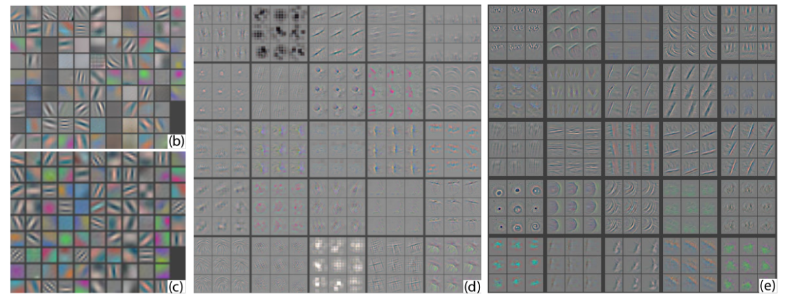

Visualizing and Understanding Convolutional Nerworjs
2014 ECCV 
纽约大学

## 简单介绍(What)
1. 提出了一种可视化技巧，能够看见CNN中间层的 特征功能和 分类操作
2. 通过对这些可视化信息进行分析，我们可以：
   * 直观了解和分析CNN学到的特征(中间层特征对应什么样的图像)
   * 可以找到提升模型的方法(观察中间层特征，分析模型可以改进的地方)
   * 分析CNN的遮掩敏感性(遮住某一块区域后对分类结果的影响)
3. 这种可视化技巧主要用到反卷积的技术，把中间层的激活特征映射回输入空间。

## 论文动机(Why)
1. 虽然CNN在图像任务上取得了优秀的表现，但是看不到CNN的内部操作和复杂模型的表现行为，不清楚它们为何会取得这么好的效果。
2. 在科学的角度上，这是不能接收的，没有清晰地理解CNN是如何工作以及为什么这样运作，那么他的发展和进步就只能靠不断地“trial and error”

## 怎么做的(How)
1. 论文的网络结构和 alexnet很类似，做了一些改动，比如 stride变成2，11x11的卷积核变为了7x7的卷积核。
2. 为了把中间层的激活块映射会输入空间，使用了反卷积技术，变成如下图所示，右边是卷积网，左边是反卷积网。

3. 反池化： 由于池化操作不可逆，使用了一个近视可逆的方法，用 Switches 记录每个池化块的最大值的位置，如下图所示，这样就可以利用 Switches 和 池化后的特征图，反池化成 Unpooled Maps.
4. relu: 反池化后，为了获得有效的特征重建，也是用 Relu,得到 Rectified Unpooled Maps.
5. 反卷积:用原来的卷积核转置版本，进行卷积操作，得到重建的 Reconstruction

## 特征可视化
1. 下图是对 Imagenet训练完成后，在验证数据集上进行 反卷积得到的各层的可视化结果。
2. 对于某个给定的 feature map.在数据集上选取激活值最强的9张土，画成一个九宫格，把它们映射回输入空间后可以看到不同结构的重建特征图(灰色的图)，以及这些特征图对应的图像块(那些彩色图)
3. 可以看到彩色图的变化比灰色图更大，因为灰色图是集中于给出那些具有 **区分性**的信息。

4. 可以看到每一层似乎在学习不同的东西，第二层学习边缘，角落信息；第三层学习了一些比较复杂的模式，网状，轮胎；第四层展示了一些比较明显的变化，但是与类别更加相关了。比如狗脸，鸟腿；第五层则看到了整个物体，比如键盘，狗。

## 训练过程的特征演化
1. 下图是随着训练的迭代，特征图的变化，每一层里面的8列表示不同epoch时的特征图。
2. 列出的特征图时，对于该层的某个 ferture map,在所有训练集中激活最强的那个样本的 feature map
3. 可以看到，低层的特征图收敛比较快，而高层的特征图要到后面的 epoch才开始变动。

## 帮助提升模型
1. 通过可视化可以看到 Alexnet 模型中第一层和第二层(下图的b和d)存在一些问题，比如第二层有一些重叠和混乱，主要是步长为4引起。
2. 通过把第一层11x11卷积核变为7x7,然后stride从4变成2，得到的结果如图 c 和 e所示，得到了更多独特的特征。
3. 这样的改动也提升了模型的效果。

## 遮挡敏感性
1. 如下图所示，以第一张小狗图为例子，b图表示第5层激活最强的 feature map.每个位置的颜色表示那个位置被遮挡后的激活，可以看到，遮住狗脸后，激活值最低，也就是蓝色那块区域，说明遮挡对模型有影响。
2. c图表示被遮住不同区域后，第5层激活最强的 feature map,第一个图表示遮住狗脸后的。
3. d图中每个位置的颜色表示那个位置被遮挡后，正确类别的概率，可以看到遮住狗脸后，概率很低，蓝色那一块，说明遮挡对模型有影响。
4. 这展示了模型的遮挡敏感性，模型确实学习到了物体的位置，而不是说只学习到物体的环境上下文。

## 实验
1. 基于可视化后对 Alexnet模型进行了修改，提升了表现，说明可以通过可视化的技巧分析和改善模型
2. 对模型(alexnet以及自己修改后的模型)进行删除层，修改层神经元大小，对比实验结果
3. 把ImageNet训练好的模型用于Caltech-101，Caltech-256和PASCAL 2012数据集的训练，发现ImageNet预训练过的模型表现要（比没预训练过的）好很多，而且击败了一些前人的工作，说明了CNN提取的特征的泛化能力，以及ImageNet特征的强大。
4. 通过逐渐提升（预训练模型中保留的）层数（比如1层，2层，3层升到7层），把这些特征送到SVM和softmax中去分类，得到的结果对比，发现层数越深，学到的特征越有用。